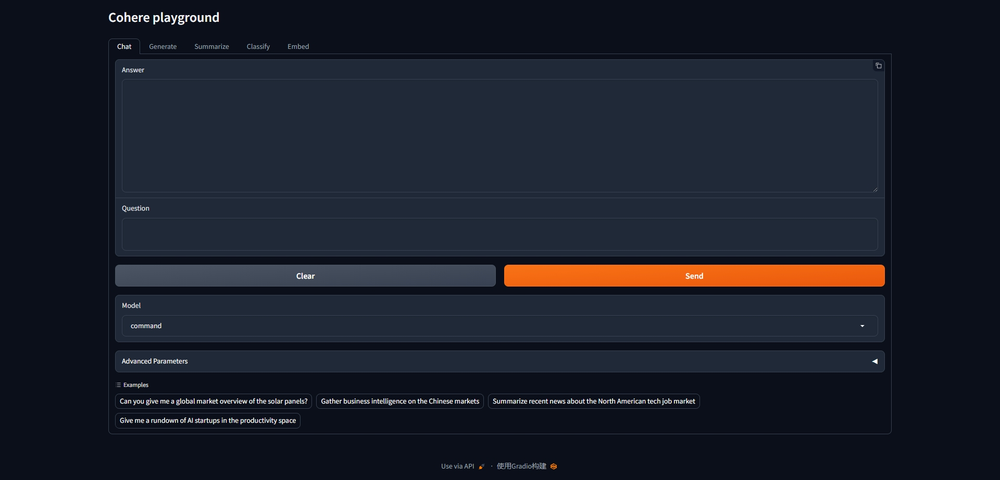
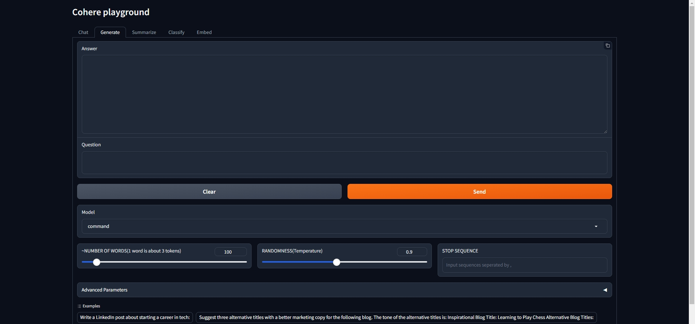
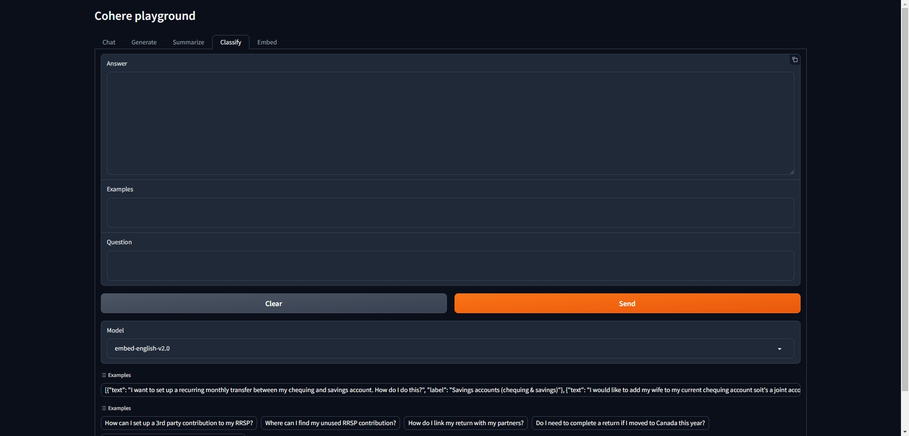
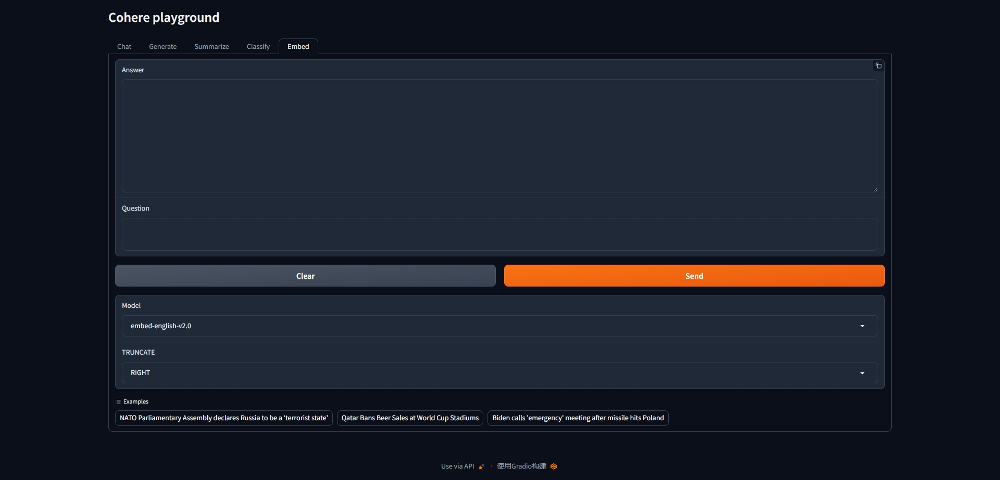

# cohere-playground

(**Unofficial**) Cohere Coral and Playground for learning cohere

## prepare

create conda environment,

```
conda create -n cohere-playground python=3.10 -y
conda activate cohere-playground
```

install requirements,

```
pip install -r requirements.txt
```

create .env file,

```
cp .env.example .env
```

modify cohere api key,

```
vi .env

---
COHERE_API_KEY=<input your cohere api key which is from https://dashboard.cohere.com/api-keys>
---
```

# launch cohere coral

```
python coral.py
```

## access cohere coral

open [http://127.0.0.1:7860](http://127.0.0.1:7860) or [http://127.0.0.1:7860/?__theme=dark](http://127.0.0.1:7860/?__theme=dark)

## launch cohere playground

```
python playground.py
```

## access cohere playground

open [http://127.0.0.1:7860](http://127.0.0.1:7860) or [http://127.0.0.1:7860/?__theme=dark](http://127.0.0.1:7860/?__theme=dark)










